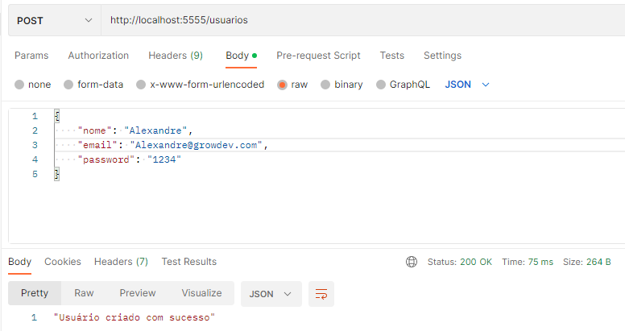

# Atividade-Back-End
# Esta atividade consiste em ser um Back-end com as segintes funcionalidades:
# Criação de conta
para criar um usuario devo informar o nome, email e password,
caso o email for uma string vazio será retornado a mensagem "Email inválido"
caso o usuario ja tenha sido criado será retornado a mensagem "E-mail já cadastrado"
exemplo:

# login 
para realizar o login é necessário informar email e password;
caso o email ou password seja uma string vazia irá retornar a mensagem "E-mail ou senha Inválidos",
caso o usuario não exista será retornada a mensagem "Usuario invalido"
# listar 
 esta requisição serve para visualizar os usuarios listados e capturar o id de cada usuario caso queira criar o recado

# CRUD de Recados

# Criar recado 
para criar o recado deve ser informado o id: (capturado em listar o usuario ), titulo e descrição do recado 
cada usuario só podera registrar um recado 
caso o usuario tente novamente registar outro recado  com o mesmo id será retornado a mensagem "já existe um recado para este usuário"
# Listar recados
esta requisição serve para visualizar os recados registrados
# Atualizar recado por id
para atualizar o recado o id do recado desejado deverá ser inserido ao final da url 
# Deletar recado por id
para deletar o recado o id do recado desejado deverá ser inserido ao final da url
